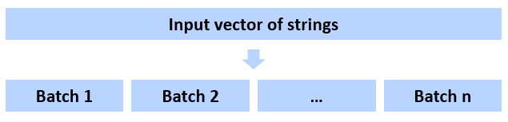
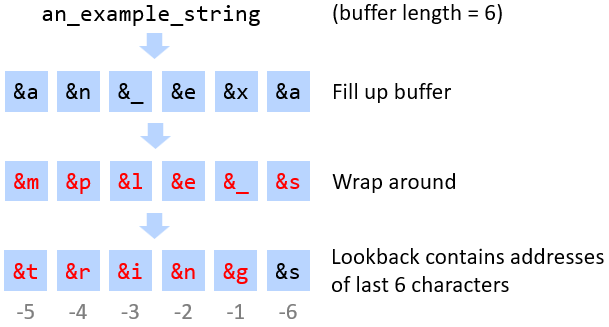

# ffunc

**ffunc** is an R package containing fast utility functions, implemented in C.

Functions:
* `fsubstr` - Fast substring
* `fstr_sub` - Fast substring which allows negative start and stop positions

## Installation

Run the following commands in R. If necessary, install the devtools package first.
```R
devtools::install_github("Architect95/ffunc", ref="main")
library(ffunc)
```

## Functions

### `fsubstr(x, start, stop)`

Drop-in replacement for `substr()`, optimised for speed over vectors. The majority of the speed gain is due to parallelisation.

As with `substr()`, the resulting substrings can be assigned to, using `fsubstr(x, start, stop) <- value`.

#### Example

```R
> string <- "abcdefgh"

> fsubstr(string, 2, 5)
[1] "bcde"

> fsubstr(string, 2, 5) <- "_"
> string
[1] "a_cdefgh"

> fsubstr(string, 2, 5) <- "123456"
> string
[1] "a1234fgh"
```


#### How `fsubstr()` works

1. The string vector is split into batches, each one shorter than `FAST_ARRAY_MEM_LIMIT` to avoid slow memory access (e.g. due to cache misses)
.
2. For each batch:
    1. each string in a batch is processed using the internal function `substrSingleElt()`, which can run on multiple threads in parallel. The results are stored in the temporary array `substrings`;
    2. the substrings are then written into the `output` string vector (writing strings must be done in series because writing to R's string hash table is not thread-safe). The majority of `fsubstr`'s execution time is spent here.

`fsubstr()<-` does not use parallel processing because a new string is produced for each string in the input vector - storing these in a temporary vector can take a considerable amount of memory if the input strings are long enough. By contrast, in `fsubstr()`, only the start and end points and the encoding of each substring need to be written, so the memory usage is limited.


### `fstr_sub(x, start, stop)`

Another fast substring function, in which negative start and stop arguments may be used to count backwards from the end of the input string.

#### Example

```R
> string <- "abcde"

> fstr_sub(string, -4, -2)
[1] "bcd"

> fstr_sub(string,  1, -4)
[1] "ab"

> fstr_sub(string,  4,  5)
[1] "de"
```


#### How `fstr_sub()` works

`fstr_sub()` follows the same routine as `fsubstr()` for positive start and stop values. On strings in multibyte character encodings where the string must be traversed from the start in order to determine the position of any given character, the following method is used for start or stop values that are negative offsets from the end of the string.
1. As the string is traversed forwards, the addresses of each character are written into a lookback buffer of length `m` called `last_m_char_ptrs`, wrapping around and overwriting earlier characters if the buffer length is exceeded.
2. Once the end of the string is reached and the negative relative offset has been converted to an absolute character index, the address of the relevant character can be retrieved directly from the lookback buffer instead of having to traverse the string from the start again.

For example:



In this example, `fstr_sub(str, -4, -2)` can now be easily obtained from the lookback buffer, without having to traverse the string again. This saves time on long strings with negative offsets that are close enough to the end of the string.

If the lookback buffer will be too short to contain the address of the negative start/stop index then the lookback buffer is not used. Instead, the address of the relevant index is obtained by traversing the string from the start for a second time.